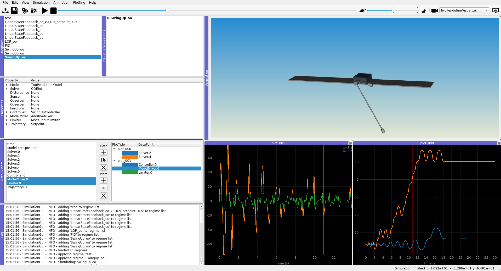

=========
PyMoskito
=========

.. image:: https://github.com/cklb/pymoskito/actions/workflows/ci.yaml/badge.svg
    :target: https://github.com/cklb/pymoskito/actions/workflows/ci.yaml
    :alt: Continuous Integration Tests

.. image:: https://img.shields.io/pypi/v/pymoskito.svg
    :target: https://pypi.python.org/pypi/pymoskito
    :alt: Link to PyPi

.. image:: https://readthedocs.org/projects/pymoskito/badge/?version=stable
    :target: http://pymoskito.readthedocs.io/en/stable/
    :alt: Documentation Status

.. image:: https://zenodo.org/badge/49145679.svg
   :target: https://zenodo.org/badge/latestdoi/49145679
   :alt: DOI index 49145679

PyMoskito stands for *Python based modular simulation & postprocessing kickass
toolbox* and is **Free software** (GPLv3)

PyMoskito is targeted at students and researchers working in control
engineering. It takes care of all structure related programming a let's you
focus on the important things in life: **control design**.

It features a modular control loop structure that already contains most of the
needed blocks a control engineer needs. Basically you implement your systems
dynamics as well as a fancy control law and you are ready to go.
On top PyMoskito also contains a GUI which let's you easily fine-tune the
parameters of your simulation.

**Go ahead and give it a try!**

Documentation can be found at https://pymoskito.readthedocs.org.

PyMoskito at work
-----------------
The main application simulating the **Tandem Pendulum** system:

Still here? So PyMoskito features
---------------------------------
* Quick setup due to lightweight dependencies
* Modular control loop structure allowing easy configuration
* Easy integration of own system models through open interface
* Automatic simulation of simulation regimes (i.e. for parameter ranges)
* Export of simulation results for dedicated post processing
* VTK based 3D visualization interface
* Playback functions for 3D visualization
* Ready-to-go graphs for all simulation signals
* Execution of external C++ code via *pybind11*

Getting started
---------------

Install with pip::

    $ pip install pymoskito

and run an example::

    $ python -m pymoskito.examples.pendulum
