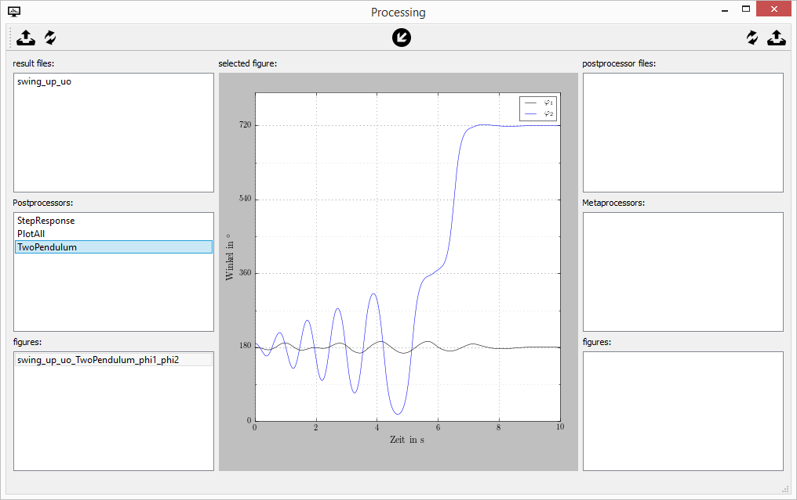

=========
PyMoskito
=========

.. image:: https://img.shields.io/travis/cklb/pymoskito.svg
    :target: https://travis-ci.org/cklb/pymoskito
    :alt: Status of continuous integration

.. image:: https://img.shields.io/pypi/v/pymoskito.svg
    :target: https://pypi.python.org/pypi/pymoskito
    :alt: Link to PyPi

.. image:: https://readthedocs.org/projects/pymoskito/badge/?version=master
    :target: http://pymoskito.readthedocs.io/en/master/?badge=master
    :alt: Documentation Status

PyMoskito stands for *Python based modular simulation & postprocessing kickass
toolbox* and is **Free software** (GPLv3)

PyMoskito is targeted at students and researchers working in control
engineering. It takes care of all structure related programming a let's you
focus on the important things in life: **control design**
It features a modular control loop structure that already contains most of the
needed blocks a control engineer needs. Basically you implement your systems
dynamics as well as a fancy control law and you are ready to go.
On top PyMoskito also contains a GUI which let's you easily fine-tune the
parameters of your simulation.

**Go ahead and give it a try!**

Documentation can be found at https://pymoskito.readthedocs.org.

PyMoskito at work:
------------------
The main application simulating the **Ball and Beam** system:

.. image:: ./docs/pictures/pm_2.png

The postprocessing application:

.. image:: ./docs/pictures/pm_3.png

Another example a **Double Pendulum**:

.. image:: ./docs/pictures/pm_4.png

with custom prostprocessors:

Still here? So PyMoskito features:
----------------------------------
* quick setup due to lightweight dependencies
* modular control loop structure allowing easy configuration
* easy integration of own system models through open interface
* automatic simulation of simulation regimes (i.e. for parameter ranges)
* export of simulation results for dedicated post processing
* VTK based 3D visualization interface
* playback functions for 3D visualization
* ready-to-go graphs for all simulation signals

Maintainers
-----------
* Stefan Ecklebe
* Christoph Burggraf

Contributors
------------
Marcus Riesmeier