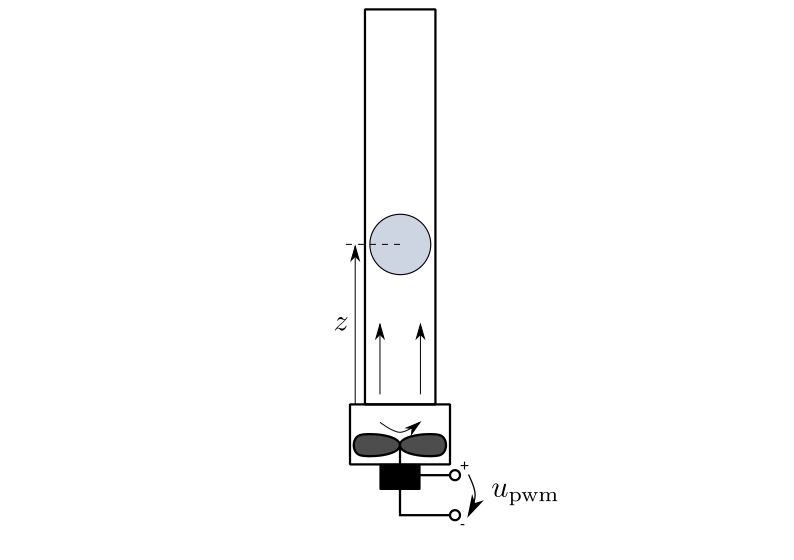

=========================
Ball in Tube 2 (balltube)
=========================

A fan at the bottom of a tube produces an air stream moving upwards.
A ball levitates in the air stream.

The task is to control the ball's position :math:`z`.
Actuating variable is the motor's control signal :math:`u_{pwm}`.

The example comes with two models, which differ in the reaction to the ball falling down.
The :py:class:`BallInTubeModel` makes the ball stick to the ground once it falls down.
The :py:class:`BallInTubeSpringModel` lets the ball to jump back up again:

.. toctree::

  BT_model1
  BT_model2

The only controller specific to this example creates an open loop:

.. toctree::
  
  BT_ctrl1

The ball's position is used as a flat output in this flatness based feedforward module:

.. toctree::
  
  BT_ff1

A 3D visualizer is implemented.
In case of missing libraries, a 2D visualization can be used instead.
  
An external :py:data:`settings` file contains all parameters.
All implemented classes import their initial values from here.

Regimes are stored in two files.
At program start, the main loads six regimes from the file :py:data:`default.sreg`.
In addition, nine regimes can be loaded manually from the file :py:data:`experiments.sreg`.

The example also provides a package for symbolic calculation.