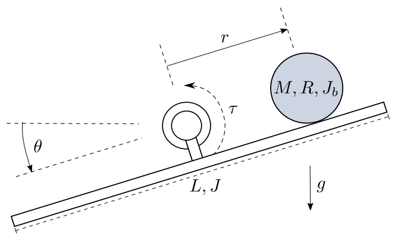

========================
Ball and Beam (ballbeam)
========================

A beam is pivoted on a bearing in its middle.
The position of a ball on the beam is controlable by applying a torque into the bearing.

The ball has a mass :math:`M`, a radius :math:`R` and a moment of inertia :math:`J_b`.
Its distance :math:`r` to the beam center is counted positively to the right.
For the purpose of simplification, the ball can only move in the horizontal direction.

The beam has a length :math:`L`, a moment of inertia :math:`J`
and its deflection from the horizontal line is the angle :math:`\theta`.

The task is to control the position  :math:`r` of the ball with the actuation
variable being the torque :math:`\tau`. The interesting part in this particular
system is that while being nonlinear and intrinsically unstable, it's relative
degree is not well-defined. This makes it an exciting but yet still clear lab
example. The description used here is taken from the publication [Hauser92]_ .

    
    The ball and beam system

With the state vector 

.. math::
    
    \boldsymbol{x} 
    =
    \begin{pmatrix}
        x_1 \\
        x_2 \\
        x_3 \\
        x_4
    \end{pmatrix} 
    =
    \begin{pmatrix}
        r \\
        \dot{r} \\
        \theta \\
        \dot{\theta}
    \end{pmatrix},

the nonlinear model equations are given by

.. math::
    
    \boldsymbol{\dot{x}} 
    =
    \begin{pmatrix}
        \dot{x}_1 \\
        \dot{x}_2 \\
        \dot{x}_3 \\
        \dot{x}_4
    \end{pmatrix} 
    =
    \begin{pmatrix}
        x_2 \\
        \frac{M R^2}{J_b + M R^2} (x_1 x_4^2 - g \sin(x_3)) \\
        x_4 \\
        \frac{\tau - M \cdot (2x_1 x_2 x_4 + g x_1 \cos(x_3))}{M x_1^2 + J + J_b}
    \end{pmatrix}.
    
Violations of the model's boundary conditions are the ball leaving the beam

.. math::

    |x_1| > \frac{L}{2}

or the beam's deflection reaching the vertical line

.. math::

    |x_3| > \frac{\pi}{2}.

The ball's position

.. math::

    y = x_1 = r

is chosen as output.

The example comes with five controllers.
The :py:class:`FController` and :py:class:`GController` both implemenent a input-output-linearization of the system
and manipulate the second output derivative by ignoring certain parts of the term. 
The :py:class:`JController` ignores the nonlinear parts of the linearized model equations,
also called standard jacobian approximation.
The :py:class:`LSSController` linearizes the nonlinear model in a chosen steady state 
and applies static state feedback.
The :py:class:`PIXController` also linearizes the model and additionally integrates the control error.

:py:class:`LinearFeedforward` implements a compensation of the linear system equation parts,
with the aim of reducing the controllers task to the nonlinear terms of the equations and disturbances.

The example comes with four observers.
:py:class:`LuenbergerObserver`, :py:class:`LuenbergerObserverReduced` and :py:class:`LuenbergerObserverInt`
are different implementations of the Luenberger observer. 
The second of these improves its performance by using a different method of integration and the third uses the solver for integration.
The :py:class:`HighGainObserver` tries to implement an observer for nonlinear systems,
However, the examination for observability leads to the presumption that this attempt should fail.

A 3D visualizer is implemented.
In case of missing VTK, a 2D visualization can be used instead.
  
An external :py:data:`settings` file contains all parameters.
All implemented classes import their initial values from here.

At program start, the main loads two regimes from the file :py:data:`default.sreg`.
:py:data:`test-nonlinear` is a setting of the nonlinear controller moving the ball from the left to the right side
of the beam.
:py:data:`test-linear` shows the step response of a linear controller, resulting in the ball moving from the middle to the right side of the beam.

The example also provides ten different modules for postprocessing. 
They plot different combinations of results in two formats, one of them being :py:data:`.pdf`.
The second format of files can be given to a metaprocessor.

The structure of :py:data:`__main__.py` allows starting the example without navigating to the directory
and using an :py:data:`__init__.py` file to outsource the import commands for additional files.
    
.. [Hauser92] Hauser, J.; Sastry, S.; Kokotovic, P.
    Nonlinear Control Via Approximate
    Input-Output-Linearization: The Ball and Beam Example. IEEE Trans. on
    Automatic Control, 1992, vol 37, no. 3, pp. 392-398