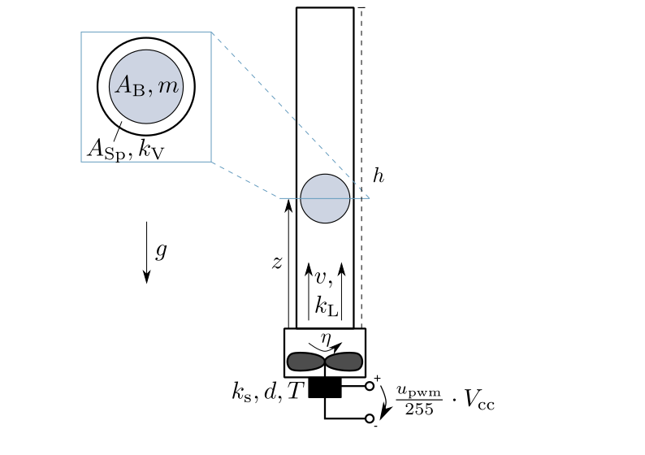

=======================
Ball in Tube (balltube)
=======================

A fan at the bottom of a tube produces an air stream moving upwards.
A ball levitates in the air stream.

The fan rotates with the rotational speed :math:`\eta`.
It produces an air stream with the velocity :math:`v`.
The factor :math:`k_L` describes the proportionality between the air's volume flow rate and the fan's rotational speed.
The motor driving the fan is modeled as a PT2-element with the amplification :math:`k_s`,
the damping :math:`d` and the time constant :math:`T`.
An Arduino Uno controls the motor,
its discrete control signal :math:`u_{pwm}` has a range of :math:`0 - 255`
and amplifies the supply voltage :math:`V_{cc}`.

The ball has an area :math:`A_B` and a mass :math:`m`.
Its distance to the tube's bottom is the position :math:`z`.
The gap between the ball and the tube has an area :math:`A_{Sp}`.
The factor :math:`k_V` describes the proportionality between
the force of flow resistance and the velocity of the air streaming through the gap.

The tube has a height :math:`h`.

The task is to control the ball's position :math:`z`.
Actuating variable is the motor's control signal :math:`u_{pwm}`.

The example comes with two models, which differ in the reaction to the ball falling down.
The :py:class:`BallInTubeModel` sets the ball's position and speed to zero once the ball touches the ground.
The :py:class:`BallInTubeSpringModel` enables the ball to jump back up again by inserting a spring at the bottom of the tube.
All of the following equations are implemented in both models if not pointed out otherwise.

The state vector :math:`\boldsymbol{x}` is chosen as:

.. math::
    
    \boldsymbol{x} 
    =
    \begin{pmatrix}
        x_1 \\
        x_2 \\
        x_3 \\
        x_4
    \end{pmatrix} 
    =
    \begin{pmatrix}
        \eta \\
        \dot{\eta} \\
        z \\
        \dot{z}
    \end{pmatrix} 

The model equations are given as:

.. math::
    
    \boldsymbol{\dot{x}} 
    =
    \begin{pmatrix}
        \dot{x}_1 \\
        \dot{x}_2 \\
        \dot{x}_3 \\
        \dot{x}_4
    \end{pmatrix} 
    =
    \begin{pmatrix}
        x_2 \\
        -\frac{1}{T^2} x_1 - \frac{2 d}{T} x_2 + \frac{k_s}{T^2} \frac{u_{pwm}}{255} V_{cc} \\
        x_4 \\
        \frac{k_L}{m}(\frac{k_V x_1 - A_B x_4}{A_{Sp}})^2-g
    \end{pmatrix} 
    
In the :py:class:`BallInTubeSpringModel` only, 
the fourth system equation is overwritten by an extended version 
in case of a position :math:`z` below zero.
This adds a spring with the stiffness :math:`K` and the damping :math:`D` at the ground of the tube:

.. math::
    
    \dot{x}_4 = \frac{K x_3}{m} - \frac{D x_4}{m} + \frac{k_L}{m}\left(\frac{k_V x_1 - A_B x_4}{A_{Sp}}\right)^2-g
    
The model's boundary condition is violated if the ball leaves the tube on the upper end:

.. math::
    
    x_3 > h

The ball's position is chosen as output:

.. math::

    y = x_3 = z
