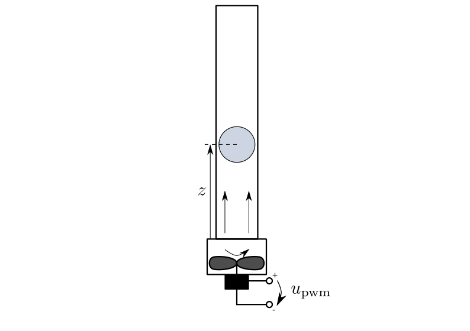

=========================
Ball in Tube (balltube)
=========================

A fan at the bottom of a tube produces an air stream moving upwards.
A ball levitates in the air stream.

The task is to control the ball's position :math:`z`.
Actuating variable is the motor's control signal :math:`u_{pwm}`.

    
    The ball in tube system

The example comes with two models, which differ in the reaction to the ball falling down.
The :py:class:`BallInTubeModel` makes the ball stick to the ground once it falls down.
The :py:class:`BallInTubeSpringModel` lets the ball to jump back up again:

.. toctree::

  model1
  model2

The :py:class:`OpenLoop` controller ignores the current state and output of the model,
as well as trajectory values.
Instead it gives the opportunity to set the actuating variable :math:`u_{pwm}` manually.

The ball's position is used as a flat output in this flatness based feedforward module:

.. toctree::
  
  ff1

A 3D visualizer is implemented.
In case of missing VTK, a 2D visualization can be used instead.
  
An external :py:data:`settings` file contains all parameters.
All implemented classes import their initial values from here.

Regimes are stored in two files.
At program start, the main function loads six regimes from the file :py:data:`default.sreg`.
In addition, nine regimes can be loaded manually from the file :py:data:`experiments.sreg`.
   
The structure of :py:data:`__main__.py` allows starting the example without navigating to the directory
and using an :py:data:`__init__.py` file to outsource the import commands for additional files.

The example also provides a package for symbolic calculation.