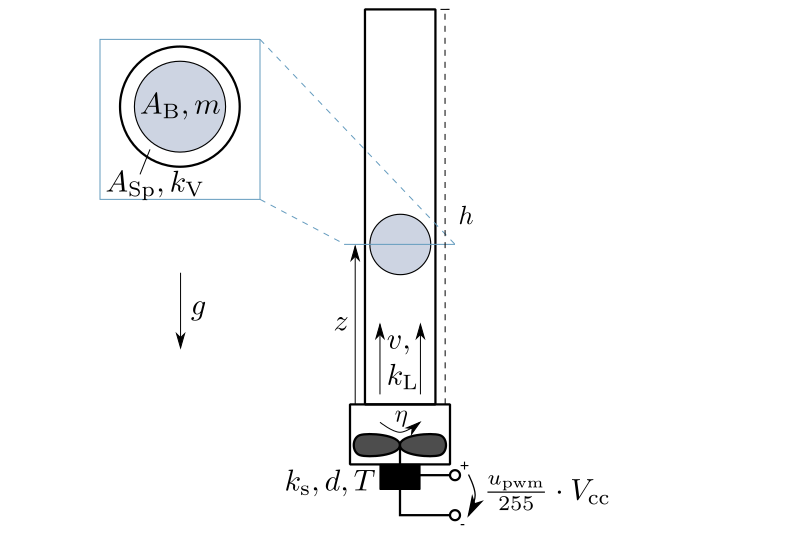

=======================
Ball in Tube Model
=======================

The fan rotates with the rotational speed :math:`\eta`.
It produces an air stream with the velocity :math:`v`.
The factor :math:`k_{\textup{L}}` describes the proportionality between the air's volume flow rate and the fan's rotational speed.
The motor driving the fan is modeled as a PT2-element with the amplification :math:`k_{\textup{s}}`,
the damping :math:`d` and the time constant :math:`T`.
An Arduino Uno controls the motor,
its discrete control signal :math:`u_{\textup{pwm}}` has a range of :math:`0 - 255`
and amplifies the supply voltage :math:`V_{\textup{cc}}`.
The ball covers an area :math:`A_{\textup{B}}` and has a mass :math:`m`.
Its distance to the tube's bottom is the position :math:`z`.
The gap between the ball and the tube covers an area :math:`A_{\textup{Sp}}`.
The factor :math:`k_{\textup{V}}` describes the proportionality between
the force of flow resistance and the velocity of the air streaming through the gap.
The tube has a height :math:`h`.
The system is shown in :numref:`fig-balltube`.

.. _fig-balltube:

    
    The ball in tube system in detail

With the state vector 

.. math::
    
    \boldsymbol{x} 
    =
    \begin{pmatrix}
        x_1 \\
        x_2 \\
        x_3 \\
        x_4
    \end{pmatrix} 
    =
    \begin{pmatrix}
        \eta \\
        \dot{\eta} \\
        z \\
        \dot{z}
    \end{pmatrix} ,

the model equations are given by

.. math::
    
    \boldsymbol{\dot{x}} 
    =
    \begin{pmatrix}
        \dot{x}_1 \\
        \dot{x}_2 \\
        \dot{x}_3 \\
        \dot{x}_4
    \end{pmatrix} 
    =
    \begin{pmatrix}
        x_2 \\
        -\frac{1}{T^2} x_1 - \frac{2 d}{T} x_2 + \frac{k_{\textup{s}}}{T^2} \frac{u_{\textup{pwm}}}{255} V_{\textup{cc}} \\
        x_4 \\
        \frac{k_{\textup{L}}}{m}(\frac{k_{\textup{V}} x_1 - A_{\textup{B}} x_4}{A_{\textup{Sp}}})^2-g
    \end{pmatrix}.
    
In case of the ball falling down and reaching a position :math:`x_3 < 0` below the fan,
the root function of the model overrides the ball's position and velocity with zeros, thereby stopping the ball.
    
The model's boundary condition is violated if the ball leaves the tube on the upper end:

.. math::
    
    x_3 > h

The ball's position 

.. math::

    y = x_3 = z

is chosen as output.