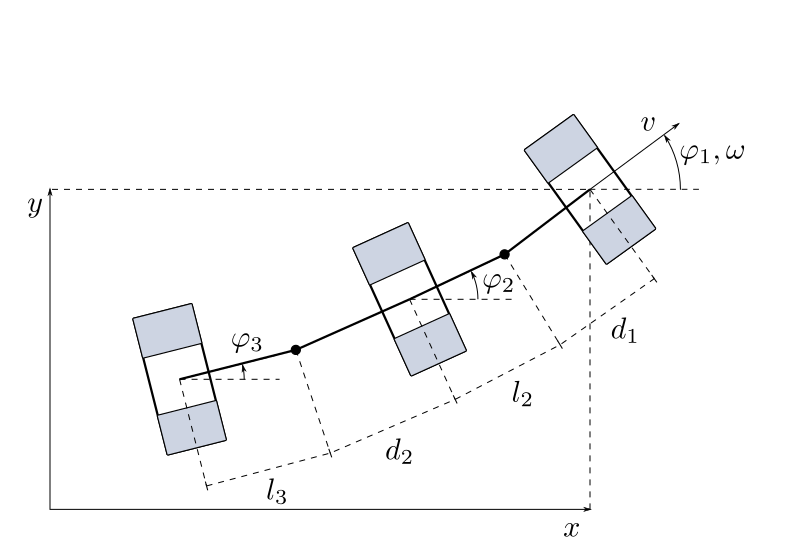

=======================
Car with Trailers (car)
=======================

A car pulls multiple trailers. All parts of the vehicle have one axis for simplification.

The car moves forward with a velocity :math:`v` and turns with a ratotional speed :math:`\omega`.
The coordinates :math:`x` and :math:`y` describe the car's distance to the <Ursprung> of a stationary coordinate system.

The car's and the trailer's deflections regarding the horizontal line are :math:`\varphi_1`, :math:`\varphi_2` and :math:`\varphi_3`.

The distances between the axes and the couplings are :math:`d_1`, :math:`l_2`, :math:`d_2` and :math:`l_3`

The state vector :math:`\boldsymbol{x}` is chosen as:

.. math::
    
    \boldsymbol{x} 
    =
    \begin{pmatrix}
        x_1 \\
        x_2 \\
        x_3 \\
        x_4 \\
        x_5
    \end{pmatrix} 
    =
    \begin{pmatrix}
        x \\
        y \\
        \varphi_1 \\
        \varphi_2 \\
        \varphi_3
    \end{pmatrix} 

The model equations are given as:

.. math::
    
    \boldsymbol{\dot{x}} 
    =
    \begin{pmatrix}
        \dot{x}_1 \\
        \dot{x}_2 \\
        \dot{x}_3 \\
        \dot{x}_4 \\
        \dot{x}_5
    \end{pmatrix} 
    =
    \begin{pmatrix}
        v \cos(x_3)\\
        v \sin(x_3)\\
        \omega \\
        \frac{1}{l_2} \sin(x_3 - x_4) v - \frac{d_1}{l_2} \cos(x_3 - x_4) \omega \\
        \dot{x}_5
    \end{pmatrix} 
    
.. math::
    
    \dot{x}_5
    =
    \left(\frac{1}{l_3} \sin(x_3 - x_5) - \frac{l_2 + d_2}{l_2 l_3} \sin(x_3 - x_4) \cos(x_4 - x_5)\right) v + \dots \\
    \dots + \left(-\frac{d_1}{l_3} \cos(x_3 - x_5) + \frac{d_1 (l_2 + d_2)}{l_2 l_3} \cos(x_3 - x_4) \cos(x_4 - x_5)\right) \omega
    
The driving speed :math:`v` and the turning speed :math:`\omega` are set to constant values in the state function of the model.
They are potential actuating variables to control the system.
    
There is no output defined.
    