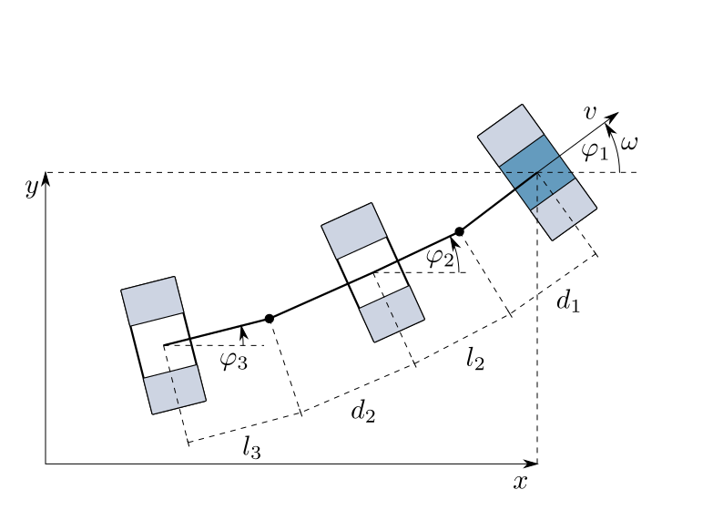

=======================
Car with Trailers (car)
=======================

A car pulls multiple trailers. All parts of the vehicle have one axis for simplification.

The car moves forward with a velocity :math:`v` and turns with a ratotional speed :math:`\omega`.
The coordinates :math:`x` and :math:`y` describe the car's distance to the origin of a stationary coordinate system.

The car's and the trailer's deflections regarding the horizontal line are :math:`\varphi_1`, :math:`\varphi_2` and :math:`\varphi_3`.

The distances between the axles and the couplings from front to back are :math:`d_1`, :math:`l_2`, :math:`d_2` and :math:`l_3`

    
    The car system

With the state vector

.. math::
    
    \boldsymbol{x} 
    =
    \begin{pmatrix}
        x_1 \\
        x_2 \\
        x_3 \\
        x_4 \\
        x_5
    \end{pmatrix} 
    =
    \begin{pmatrix}
        x \\
        y \\
        \varphi_1 \\
        \varphi_2 \\
        \varphi_3
    \end{pmatrix},

the model equations are given by

.. math::
    
    \boldsymbol{\dot{x}} 
    =
    \begin{pmatrix}
        \dot{x}_1 \\
        \dot{x}_2 \\
        \dot{x}_3 \\
        \dot{x}_4 \\
        \dot{x}_5
    \end{pmatrix} 
    =
    \begin{pmatrix}
        v \cos(x_3)\\
        v \sin(x_3)\\
        \omega \\
        \frac{1}{l_2} \sin(x_3 - x_4) v - \frac{d_1}{l_2} \cos(x_3 - x_4) \omega \\
        \dot{x}_5
    \end{pmatrix}, 
    
with
    
.. math::
    
    \dot{x}_5
    =
    \left(\frac{1}{l_3} \sin(x_3 - x_5) - \frac{l_2 + d_2}{l_2 l_3} \sin(x_3 - x_4) \cos(x_4 - x_5)\right) v + \dots \\
    \dots + \left(-\frac{d_1}{l_3} \cos(x_3 - x_5) + \frac{d_1 (l_2 + d_2)}{l_2 l_3} \cos(x_3 - x_4) \cos(x_4 - x_5)\right) \omega .
    
The driving speed :math:`v` and the turning speed :math:`\omega` are set to constant values in the state function of the model.
They are potential actuating variables to control the system.
    
There is no output defined.
    
The example comes with no controller, 
with a 2D visualization,
an external :py:data:`settings` file containing all initial values for the parameters
and one regime loaded from the file :py:data:`default.sreg` by the main at program start.
   
The structure of :py:data:`__main__.py` allows starting the example without navigating to the directory
and using an :py:data:`__init__.py` file to outsource the import commands for additional files.