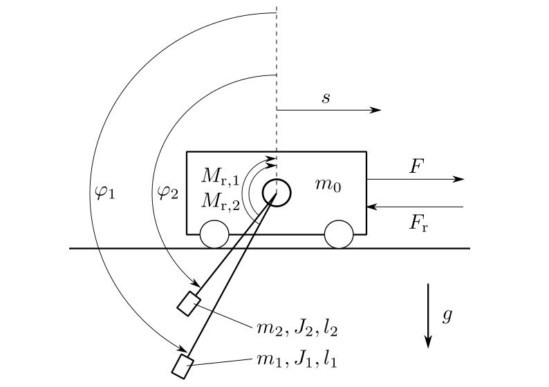

==========================
Tandem Pendulum (pendulum)
==========================

Two pendulums are fixed on a cart, which can move in the horizontal direction.

The cart has a mass :math:`m_0`. The friction between the cart and the surface causes a frictional force :math:`F_r = d_0 \cdot \dot{s}`,
in opposite direction as the velocity :math:`\dot{s}` of the cart.

Each pendulum has a mass :math:`m_i`, a moment of intertia :math:`J_i`, a length :math:`l_i` and an angle of deflection :math:`\varphi_i`.
The friction in the joint where the pendulums are mounted on the cart causes a frictional torque :math:`M_{ir} = d_i \cdot \dot{\varphi}_i`,
in opposite direction as the speed of rotation :math:`\dot{\varphi}_i`.
The system is shown in :numref:`fig-pendulum` .

The task is to control the position :math:`s` of the cart and to stabilize the pendulums in either the upward or downward position. 
Actuating variable is the force F.

.. _fig-pendulum:

    
    The pendulum system

The example comes with three models.
A point mass model, a rigid body model and a partially linearized model.

The state vector :math:`\boldsymbol{x}` is chosen in all three models as:

.. math::
    
    \boldsymbol{x} 
    =
    \begin{pmatrix}
        x_1 \\
        x_2 \\
        x_3 \\
        x_4 \\
        x_5 \\
        x_6
    \end{pmatrix} 
    =
    \begin{pmatrix}
        s \\
        \dot{s} \\
        \varphi_1 \\
        \dot{\varphi}_1 \\
        \varphi_2 \\
        \dot{\varphi}_2 
    \end{pmatrix} 

The class :py:class:`TwoPendulumModel` is the implementation of a point mass model.
The mass of each pendulum is considered concentrated at the end of its rod.
The model resulting model equations are relatively simple and moments of inertia do not appear:

.. math::

    \dot{x}
    =
    \begin{pmatrix}
        \dot{x}_1 \\
        \dot{x}_2 \\
        \dot{x}_3 \\
        \dot{x}_4 \\
        \dot{x}_5 \\
        \dot{x}_6
    \end{pmatrix} 
    =
    \begin{pmatrix}
        x_2 \\
        \frac{1}{M} \left( F_1 + F_2 + F - d_0 x_2 - \frac{d_1 x_4}{l_1} \cos(x_3) - \frac{d_2 x_6}{l_2} \cos(x_5) \right)\\
        x_4 \\
        \frac{g}{l_1}\sin(x_3) - \frac {d_1 x_4}{m_1 l_1^2} + \frac{\cos(x_3)}{l_1 M} \left( F_1 + F_2 + F - d_0 x_2 - \frac{d_1 x_4}{l_1} \cos(x_3) - \frac{d_2 x_6}{l_2} \cos(x_5) \right) \\
        x_6 \\
        \frac{g}{l_2}\sin(x_5) - \frac {d_2 x_6}{m_2 l_2^2} + \frac{\cos(x_5)}{l_2 M} \left( F_1 + F_2 + F - d_0 x_2 - \frac{d_1 x_4}{l_1} \cos(x_3) - \frac{d_2 x_6}{l_2} \cos(x_5) \right)
    \end{pmatrix}

.. math::
    
    M &= m_0 + m_1 \sin^2(x_3) + m_2 \sin^2(x_5)\\
    F_1 &= m_1 \sin(x_3)(g \cos(x_3) - l_1 x_4^2) \\
    F_2 &= m_2 \sin(x_5)(g \cos(x_5) - l_2 x_6^2)

The class :py:class:`TwoPendulumRigidBodyModel` is the implementation of a rigid body model.
The rods are considered to have a mass and can not be ignored,
each pendulum has a moment of inertia :math:`J_{DPi}`:

.. math::

    \dot{x}
    =
    \begin{pmatrix}
        \dot{x}_1 \\
        \dot{x}_2 \\
        \dot{x}_3 \\
        \dot{x}_4 \\
        \dot{x}_5 \\
        \dot{x}_6
    \end{pmatrix} 
    =
    \begin{pmatrix}
        x_2 \\
        \frac{term2 \ + \ term3 \ + \ term4}{term1} \\
        x_4 \\
        \frac {1}{J_{DP1}} \left( m_1^* l_1^* \cos(x_3) \dot{x}_2 + M_1 - d_1 x_4 +  m_1^* l_1^* g \sin(x_3)\right)\\
        x_6 \\
        \frac {1}{J_{DP2}} \left( m_2^* l_2^* \cos(x_5) \dot{x}_2 + M_2 -  d_2 x_6 + m_2^* l_2^* g \sin(x_5)\right)
    \end{pmatrix}

.. math::
    
    term1 &= m_0^* + m_1^* + m_2^* - \frac{m_1^{*2} l_1^{*2} \cos^2(x_3)}{J_{DP1}} - \frac{m_2^{*2} l_2^{*2} \cos^2(x_5)}{J_{DP2}}\\
    term2 &= \frac {m_1^* l_1^* \cos(x_3) }{J_{DP1}} (M_1 -  d_1 x_4 + m_1^* l_1^* g \sin(x_3))\\
    term3 &= \frac {m_2^* l_2^* \cos(x_5) }{J_{DP2}}(M_2 - d_2 x_6 + m_2^* l_2^* g \sin(x_5)) \\
    term4 &= F - d_0 x_2 - m_1^* l_1^* x_4^2 \sin(x_3) - m_2^* l_2^* x_6^2 \sin(x_5) \\
    
The class :py:class:`TwoPendulumModelParLin` is the implementation of a the partially linearized point mass model.
The input is chosen as

.. math::

    u_{tr} = \frac{1}{M} \left( F_1 + F_2 + F - d_0 x_2 - \frac{d_1 x_4}{l_1} \cos(x_3) - \frac{d_2 x_6}{l_2} \cos(x_5) \right),

with :math:`M`, :math:`F_1` and :math:`F_2` as before in :py:class:`TwoPendulumModel`. 
This transforms the model equations into the input afine form

.. math::

    \dot{x}
    =
    \begin{pmatrix}
        \dot{x}_1 \\
        \dot{x}_2 \\
        \dot{x}_3 \\
        \dot{x}_4 \\
        \dot{x}_5 \\
        \dot{x}_6
    \end{pmatrix} 
    =
    \begin{pmatrix}
        x_2 \\
        0 \\
        x_4 \\
        \frac{g}{l_1}\sin(x_3) - \frac {d_1 x_4}{m_1 l_1^2} \\
        x_6 \\
        \frac{g}{l_2}\sin(x_5) - \frac {d_2 x_6}{m_2 l_2^2}
    \end{pmatrix}
    +
    \begin{pmatrix}
        0 \\
        1 \\
        0 \\
        \frac{\cos(x_3)}{l_1}\\
        0\\
        \frac{\cos(x_5)}{l_2}
    \end{pmatrix}
    u_{tr}

    
All three models define the cart's position

.. math::

    y = x_1 = s

as the output of the system.
    
The example comes with five controllers.
Two of them, :py:class:`LinearStateFeedback` and :py:class:`LinearStateFeedbackParLin`, implement linear state feedback, 
both using the package :py:data:`symbolic_calculation` to calculate their gain and prefilter.
The :py:class:`LinearQuadraticRegulator`
calculates its gain and prefilter by solving the continuous algebraic Riccati equation.
The :py:class:`LjapunovController` is designed with the method of Ljapunov to stabilize the pendulums in the upward position.
And finally the :py:class:`SwingUpController`, especially designed to swing up the pendulums using linear state feedback
and to stabilize the system by switching to a Ljapunov controller once the pendulums point upwards.

A 3D visualizer is implemented.
In case of missing VTK, a 2D visualization can be used instead.
  
An external :py:data:`settings` file contains all parameters.
All implemented classes import their initial values from here.

At program start, the main loads eleven regimes from the file :py:data:`default.sreg`.
The provided regimes not only show the stabilization of the system in different
steady-states (e.g. both pendulums pointing downwards or both pointing upwards)
but also ways to transition them between those states (e.g. swinging them up).

The example also provides two modules for postprocessing. 
They plot different combinations of results in two formats, one of them being :py:data:`.pdf`.
The second format of files can be passed to a metaprocessor.
   
The structure of :py:data:`__main__.py` allows starting the example without navigating to the directory
and using an :py:data:`__init__.py` file to outsource the import commands for additional files.