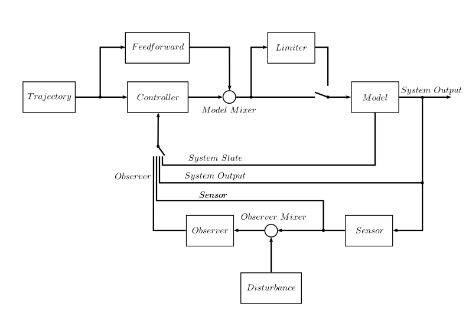

Introduction
============

What is PyMoskito ?
-------------------

PyMoskito aims to be a useful tool for students and researchers in the field of
control theory that performs repetitive task occurring in modelling as well as
controller and observer design.

The toolbox consists of two parts: Part one -the core- is a modular quasi continuous
simulation circuit whose parts (Model, Controller and many more)
can be easily fitted to one's personal needs by using one of the "ready to go"
variants or deriving from the more powerful base classes.

To configure this simulation loop and to analyse its results, part two
-the frontend- comes into play. The graphical user interface not only allows
one to accurately tune the parameters of each part of the simulation but also
allows to automate simulation runs e.g. to simulate different combinations of
modules or parameters.
This batch-like interface is feed by human readable yaml files
which make it easy to store and reproduce simulated setups.
Furthermore PyMoskito offers possibilities to run postprocessing on the
generated results and easily lets you create plots for step responses.

What is PyMoskito not ?
-----------------------

Although the simulation loop is quite flexible it is **not** a complete block
oriented simulation environment for model based-design.
However ideas for the development in this direction are always appreciated.

PyMoskito's Signal Diagram
--------------------------

PyMoskito simulates the *fixed* control loop shown in :numref:`fig-schematics`.

.. _fig-schematics:

    The control loop implemented by PyMoskito

Every block in this diagram represents a configurable part of the control loop
that is implemented as a generic base class.
By deriving from these base classes, it is easy to make sure
that implemented classes work well within the context of the toolbox.

While a lot of ready to go blocks are available, to run a basic simulation
you must at least implement the `Model` block.
For more information about the blocks are to be used look at some
:doc:`Examples <../../examples/index>`
or the
:doc:`API <../../modules/index>`
for help.

About the quasi continuous simulation approach
----------------------------------------------

*"The beginning of everything was continuous."* (unknown).

Basically the same can be set in the world of control theory.
Most of the time, one will start with a continuous system model,
for which one will design a continuous controller.
However, as the actual implementation of most controllers will
then be performed using a discrete (micro)processor, the resulting
control law is only evaluated at discrete points.
PyMoskito does the same: The provided model equations will be solved
continuously over a given step size.
After that, the remaining control loop is evaluated using the new
data, before another continuous model step is computed.
So, much like in reality if you do not wish to discretize your control
law, make sure that the step size used in the solver is small enough
to lie far below all important system time constants since the control
law will only be evaluated after such a step is completed.

On the other hand, if you have designed a discrete control law or wish
to investigate what happens if one simulation block is only evaluated say every
10th simulation step, you can set that blocks `tick_divider` to 10.

Other cool stuff
----------------

PyMoskito can perform Software in the Loop simulations by accessing your
actual controller code via pybind.
This can save a lot of time when designing controllers for embedded hardware.
