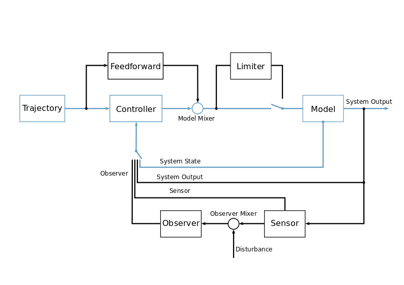

=============================
Understanding the Structure
=============================
PyMoskito simulates the control loop as seen in the schematics
below. This tutorial will focus on the part highlighted in blue,
since these modules are essential to run the toolbox:

The trajectory generator and the model mixer are considered generic,
therefore PyMoskito provides these classes fully implemented ready to use.
On the other hand, the model and the controller are determined by 
the specific system and have to be implemented to suit your problem.

If you would like to implement one of the not highlighted classes,
see the :doc:`Users Guide <../guide/index>` for help.