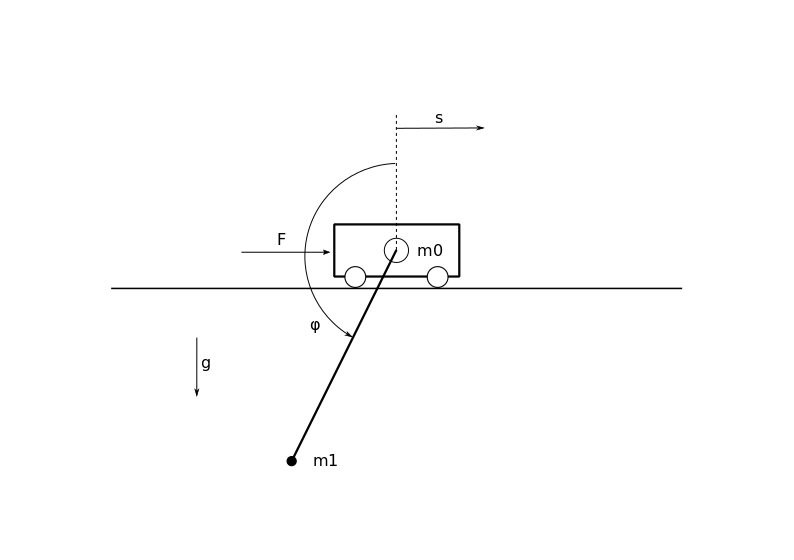

============================
Simulating a Simple Pendulum
============================

The system we will work with is a pendulum, fixed on a movable
cart. System input is the force F, system output the 
position s of the cart. 

The state vector x is given as:

.. math::
	
	\boldsymbol{x} 
	=
	\begin{pmatrix}
		x_1 \\
		x_2 \\
		x_3 \\
		x_4
	\end{pmatrix} 
	=
	\begin{pmatrix}
		s \\
		\varphi \\
		\dot{s} \\
		\dot{\varphi}
	\end{pmatrix} 

The model equations are given as:

.. math:: 

	\boldsymbol{\dot{x}} 
	=
	\begin{pmatrix}
		\dot{x_1} \\
		\dot{x_2} \\
		\dot{x_3} \\
		\dot{x_4}
	\end{pmatrix} 
	=
	\begin{pmatrix}
		x_3 \\
		x_4 \\
		\frac{JF - JDx_3 - mlJ{x_4}^2 \sin(x_2) + m^2 l^2 g \sin(x_2)\cos(x_2) - mldx_4\cos(x_2)}
			{(M+m)J - (ml\cos(x_2))^2} \\
		\frac{ml\cos(x_2)F - mlDx_3\cos(x_2) - (mlx_4)^2 \sin(x_2)\cos(x_2) + (M+m)mlg\sin(x_2) - (M+m)dx_4}
			{(M+m)J - (ml\cos(x_2))^2}
	\end{pmatrix} 

The position :math:`s` of the cart is the output of the system: 
	
.. math::

	y = x_1 = s

Create a folder with a path of your choice and name it simplePendulum.
All files created during this tutorial need to be stored here.	
To implement the presented system in PyMoskito, the mimimum to do is:

.. toctree::
  :maxdepth: 2

  new_main
  new_init
  new_model
  new_controller
  
All code is written in Python. If you want to refresh or expand 
your knowledge about this language, see the `Python Tutorial`_. 

.. _`Python Tutorial`: https://docs.python.org/3/tutorial/index.html