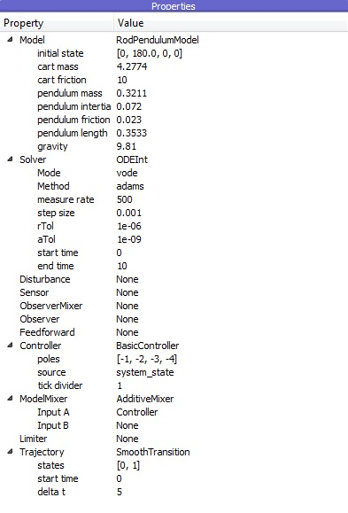
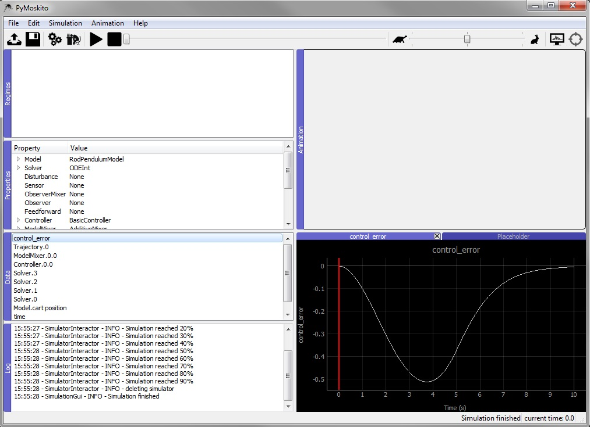

Closing the Control Loop
--------------------------------------------

Start PyMoskito loading the created files.

Choose the RodPendulum as model, the ODEInt as solver,
the BasicController as Controller, the AdditiveMixer as ModelMixer
and the SmoothTransition as Trajectory.

Change the solver's end time to 10 and Input A of ModelMixer to Controller.
To enter string values, type :py:data:`'Controller'` or :py:data:`"Controller"`
and press enter to confirm the input:

After simulating, you find a few more diagrams in the data section, 
i.e. the control error:

Feel free to experiment with the settings and see, 
if the control loop reacts the way you would have predicted.

Keep in mind that the implemented controller is static.
The control law does not adapt to changes to the model parameters,
since the controller gain is calculated from values stored in the controller class.