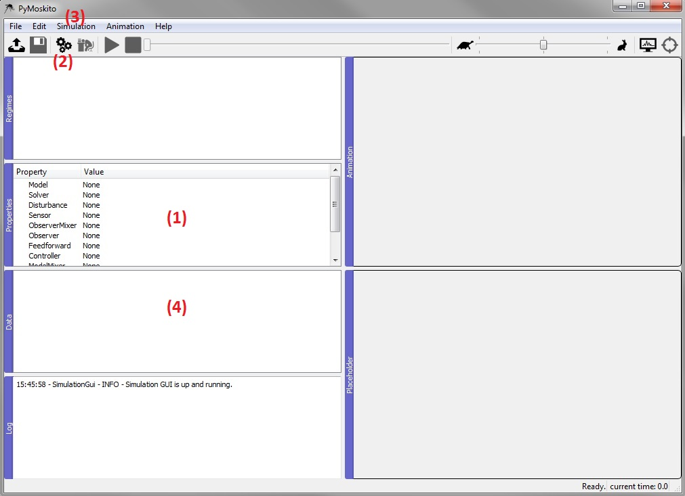
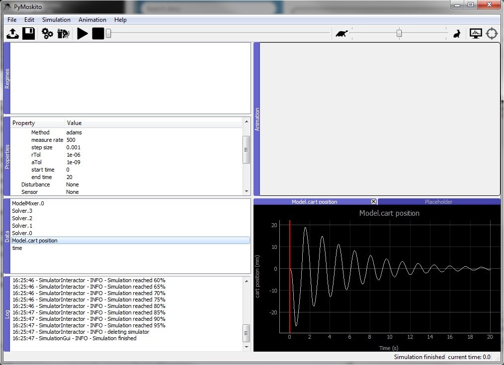

Testing the Model 
--------------------------------------------
To test your source code, but also the equations of your model,
use PyMoskito to simulate your system with no input or controller.
For the toolbox to run, 
a :py:data:`Model`, a :py:data:`Solver` and a :py:data:`ModelMixer`
need to be selected.
Choose initial states that make the prediction of the systems
reaction easy and compare them with the simulation results.

After succesfully starting the program, 
you will see the interface of the toolbox:

For a successful simulation, choices for :py:data:`Model`,
:py:data:`Solver` and :py:data:`ModelMixer` need to be made.

Within the Properties Window (1), double clicking on a value (all :py:data:`None` by default)
activates a drop down menu.
Clicking again presents all eligible options.
One of these options now is :py:class:`RodPendulumModel`,
since it was registered to PyMoskito earlier.
Choose it now and press enter to confirm your choice.

By clicking on the arrow that appeared on the left of :py:data:`Model`,
all model parameters and the initial state are displayed. 
These are taken from the :py:class:`public_settings` which have been defined earlier in the model.
Double click on a value to change it manually.
Press enter to confirm the input.

Choose the RodPendulumModel, the ODEInt as Solver and the AdditiveMixer as ModelMixer. 
Change the initial state of the model to [0,100.0, 0,0]
and the end time of the solver to 20
:

.. image:: ../pictures/ModelTest2.jpg

Click the gearwheel button (2), use the drop-down menu (3) or press F5 to start the simulation.  

After a succesful simulation, all created diagrams will be listed in the Data Window (4).
Double click on one to display it:

Feel free to experiment with the properties and see, 
if the model reacts the way you would have predicted.
