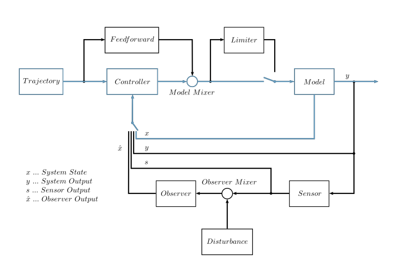

PyMoskito's Signal Diagram
--------------------------

PyMoskito simulates the control loop as shown in :numref:`fig-schematics`.
This tutorial will focus on the part highlighted in blue,
since these modules are essential to run the toolbox.

.. _fig-schematics:

    
    The control loop implemented by PyMoskito

Every block in this diagram represents a configurable part of the control loop
that is implemented as a generic base class.
By deriving from these base classes, it is easy to make sure
that implemented classes work well within the context of the toolbox.

From the highlighted classes, the trajectory generator and the model mixer are
considered reusable,
therefore PyMoskito provides these classes ready to go.
On the other hand, the model and the controller are determined by 
the specific system and have to be implemented to suit your problem.
If you would like to implement one of the nonhighlighted classes,
see the
:doc:`Users Guide <../../guide/index>`
or other
:doc:`Tutorials <../../tutorials/index>`
for help.

Next up the system, used for implementation is introduced.