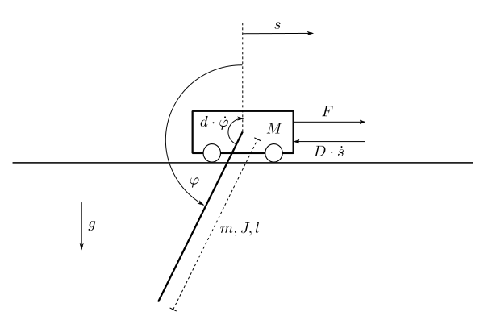

A Pendulum on Cart
------------------

A pendulum is fixed on a cart, which can move in the horizontal direction.
The cart has a mass :math:`M`. 
The friction between the cart and the surface causes a frictional force :math:`F_R = D \cdot \dot{s}`, in opposite direction to the movement of the cart.
The pendulum has a mass :math:`m`, a moment of intertia :math:`J`, a length :math:`l` and an angle of deflection :math:`\varphi`.
The friction in the joint where the pendulum is mounted on the cart causes a frictional torque :math:`M_R = d \cdot \dot{\varphi}`, 
in opposite direction to the rotational speed of the pendululm.
The system is illustrated in :numref:`fig-rodpend`.

The task is to control the position :math:`s` of the cart 
and to stabilize the pendulum in its downside position.
The possibility of stabilizing the pendulum in its upside position is not implemented in this tutorial.
Actuating variable is the force :math:`F`.

.. _fig-rodpend:

    
    The pendulum on an cart system

With the state vector

.. math::
    
    \boldsymbol{x} 
    =
    \begin{pmatrix}
        x_1 \\
        x_2 \\
        x_3 \\
        x_4
    \end{pmatrix} 
    =
    \begin{pmatrix}
        s \\
        \varphi \\
        \dot{s} \\
        \dot{\varphi}
    \end{pmatrix} ,

the model equations are given by

.. math:: 

    \boldsymbol{\dot{x}} 
    =
    \begin{pmatrix}
        \dot{x_1} \\
        \dot{x_2} \\
        \dot{x_3} \\
        \dot{x_4}
    \end{pmatrix} 
    =
    \begin{pmatrix}
        x_3 \\
        x_4 \\
        \frac{JF - JDx_3 - mlJ{x_4}^2 \sin(x_2) + m^2 l^2 g \sin(x_2)\cos(x_2) - mldx_4\cos(x_2)}
            {(M+m)J - (ml\cos(x_2))^2} \\
        \frac{ml\cos(x_2)F - mlDx_3\cos(x_2) - (mlx_4)^2 \sin(x_2)\cos(x_2) + (M+m)mlg\sin(x_2) - (M+m)dx_4}
            {(M+m)J - (ml\cos(x_2))^2}
    \end{pmatrix} .

The cart's position 

.. math::

    y = x_1 = s

is chosen as output of the system.
With this model given, the next step is to implement a class containing these equations.