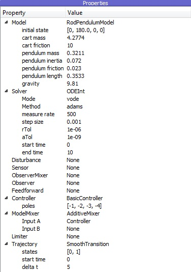

Closing the Control Loop
------------------------

Firstly, start PyMoskito from the commandline and reapply the previous
steps:

- select :py:class:`PendulumModel` as :py:data:`Model`
- change the initial state of :py:data:`PendulumModel` to ``[0, 100, 0, 0]``
- select :py:data:`ODEInt` as :py:data:`Solver`
- change the end time of :py:data:`Solver` to 10
- select :py:data:`AdditiveMixer` as :py:data:`ModelMixer`

Now, it gets interesting, select:

- the new :py:data:`BasicController` as :py:data:`Controller`
- change ``Input A`` of :py:data:`ModelMixer` to ``Controller`` and
- select :py:data:`Setpoint` as :py:data:`Trajectory`

to generate desired values for out new setup. The setpoint ``0`` demands that
the cart position (the output defined by our model) should be kept at zero.

To enter string values, type :py:data:`'Controller'` or :py:data:`"Controller"`
and remember to press enter to confirm the input.

The Properties window should now look like :numref:`fig-ControllerTest1`

.. _fig-ControllerTest1:

    
    The properties window with changes for testing applied

Now, hit ``F5`` to run the simulation.
After simulating, you find a few more diagrams in the data section.
:numref:`fig-ControllerTest2` shows the example of the control error.

.. _fig-ControllerTest2:
.. figure:: pictures/ControllerTest2.jpg
    :align: center
    :width: 80%
    :alt: Interface with Control Error
    
    PyMoskito's interface with the control error diagram displayed

Feel free to experiment with the settings and see, 
if the control loop reacts the way you would have predicted.
Keep in mind that the implemented controller is static.
The control law does not adapt to changes of the model parameters,
since the controller gain is calculated from values stored in the controller class.
You can use this effect to simulate the situation,
where the controller design was based on model parameters 
that differ from the real parameters of the process.

These were all the fundamental functions of PyMoskito considered necessary to work with it.
One more important, but also more advanced feature is the system's visualization in 2D or 3D.
This animation appears in the window at the top right, which remained grey during this tutorial 
(see :numref:`fig-ModelTest1`, :numref:`fig-ModelTest3`, :numref:`fig-ControllerTest2`).
For more information on this topic, see the
:doc:`lesson on visualization <../visualization/index>`.
