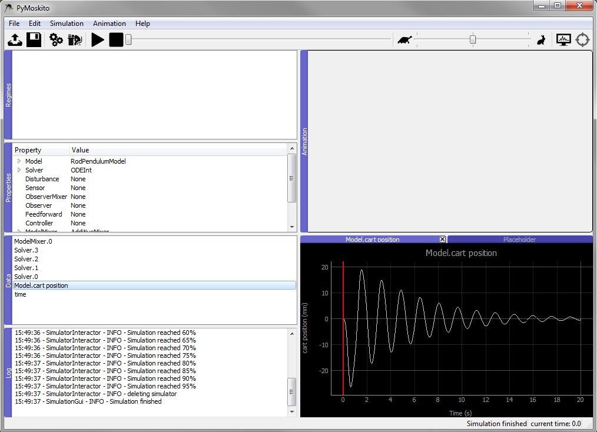

Testing the Model 
-----------------

Choose initial states that make the prediction of the system's
reaction easy and compare them with the simulation results.
After successfully starting the program,
you will see the interface of the toolbox as shown in :numref:`fig-ModelTest1`.

.. _fig-ModelTest1:
.. figure:: pictures/ModelTest1.jpg
    :align: center
    :width: 80%
    :alt: The Interface of PyMoskito after start up
    
    The Interface of PyMoskito after start up

Within the Properties Window (1), double clicking on a value (all :py:data:`None` by default)
activates a drop down menu.
Clicking again presents all eligible options.
One of these options now is :py:class:`PendulumModel`,
since it was registered to PyMoskito earlier.
Choose it now and press enter to confirm your choice.

By clicking on the arrow that appeared on the left of :py:class:`Model`,
all model parameters and the initial state are displayed. 
These are taken from the :py:class:`public_settings` which have been defined earlier in the model.
Double click on a value to change it manually.
Press enter to confirm the input.

Choose the :py:class:`PendulumModel`, the :py:class:`ODEInt` as :py:class:`Solver` and the :py:class:`AdditiveMixer` as :py:class:`ModelMixer`.
Change the initial state of :py:class:`Model` to [0, 100, 0, 0] and the end time of :py:class:`Solver` to 20 as shown in :numref:`fig-ModelTest2`.

.. _fig-ModelTest2:
.. figure:: pictures/ModelTest2.jpg
    :align: center
    :width: 80%
    :alt: The Settings for Model Test
    
    The settings for testing the model class

Click the gearwheel button (2), use the drop-down menu (3) or press F5 to start the simulation.  
After a succesful simulation, all created diagrams will be listed in the Data Window (4).
Double click on one to display it as shown in :numref:`fig-ModelTest3`.

.. _fig-ModelTest3:

    
    The Interface of PyMoskito after a successful simulation

Feel free to experiment with the properties and see, if the model reacts the way you would have predicted.
After testing the model class, a controller shall be implemented.