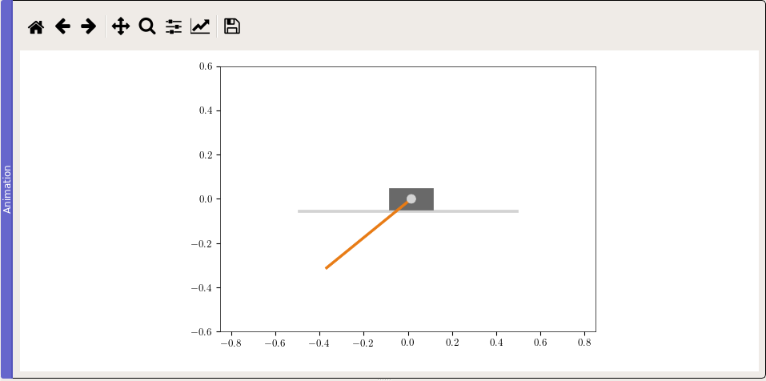

Visualization using the Matplotlib
----------------------------------

Building the visualizer
~~~~~~~~~~~~~~~~~~~~~~~

The overall plan here is to derive a class that we will call `MplPendulumVisualizer`
from :py:class:`~pymoskito.MplVisualizer`. In its constructor,
we will lay down all the elements we want to use to visualize the system.
In our case these will be the beam on which the cart is moving, the cart and
of course the pendulum. Later on, the method
:py:func:`pymoskito.MplVisualizer.update_scene`
will be called repeatedly from the GUI to update the visualization.

We will start off with the following code:

.. literalinclude:: /../pymoskito/examples/simple_pendulum/visualizer_mpl.py
    :end-before: # end parameters
    :lineno-match:

On top, we import some modules we'll need later on. Once this is done we derive
our `MplPendulumVisualizer` from :py:class:`~pymoskito.visualization.MplVisualizer`.
What follows below are some parameters for the matplotlib canvas and the objects
we want to draw, fell free to adapt them as you like!

In the first part of the constructor, we set up the canvas:

.. literalinclude:: /../pymoskito/examples/simple_pendulum/visualizer_mpl.py
    :start-after: # end parameters
    :end-before: # create patches
    :lineno-match:

Afterwards, our "actors" are created:

.. literalinclude:: /../pymoskito/examples/simple_pendulum/visualizer_mpl.py
    :start-after: # create patches
    :end-before: # add all to canvas
    :lineno-match:

Note that a transformation object is used to get the patch in the correct place
and orientation. We'll make more use of transformations later.
For now, all that is left to do for the constructor is to add our actors
t the canvas:

.. literalinclude:: /../pymoskito/examples/simple_pendulum/visualizer_mpl.py
    :start-after: # add all to canvas
    :end-before: # update callback
    :lineno-match:

After this step, the GUI knows how our system looks like. Now comes the
interesting part: We use the systems state vector (the first Equation in
:doc:`introduction <../getting_started/system>`) which we obtained from the
simulation to update our drawing:

.. literalinclude:: /../pymoskito/examples/simple_pendulum/visualizer_mpl.py
    :start-after: # update callback
    :lineno-match:

As defined by our model, the first element of the state vector `x` yields the
cart position, while the pendulum deflection (in rad) is given by ``x[1]`` .
Firstly, cart and the pendulum shaft are moved. This can either be done via
:py:func:`set_x` or by  directly overwriting the value of the :py:attr:`center`
attribute.
For the pendulum however, a transformation chain is build. It consists of a rotation
by the pendulum angle ``phi`` followed by a translation to the current cart position.
The last component is used to compensate offsets from the rendered window.

Lastly but important: The canvas is updated vie a call to ``self.canvas.draw()``

The complete class can be found under::

    pymoskito/examples/simple_pednulum/visualizer_mpl.py

Registering the visualizer
~~~~~~~~~~~~~~~~~~~~~~~~~~

To get our visualizer actually working, we need to register it. For the simple
`main.py` of our example this would mean adding the following lines:

.. literalinclude:: /../pymoskito/examples/simple_pendulum/main.py
    :language: python
    :lines: 1-7,9-19,21-24
    :emphasize-lines: 7,18
    :linenos:

After starting the program, this is what you should see in the top right corner:

.. _fig-MplVisualizer:

    Matplotlib visualization of the simple pendulum system

If you are looking for a fancier animation, check out the :doc:`VTK Tutorial <visualizer_vtk>`.
